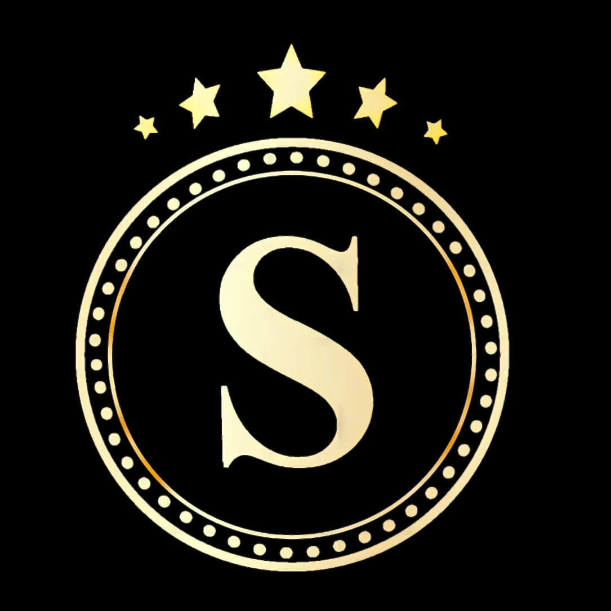

# BarberShop
> Babearia Savio

Sistema de controle de uma Barbearia, na qual o usuário poderá agendar um serviço
de corte.

## Tecnologias / Frameworks
<ul>
  <li><b>Arquitetura Hexagonal</b></li>
  <li>Spring Boot</li>
  <li>MongoDB</li>
  <li>API Rest</li>
</ul>

## Informações Adicionais
> Esse projeto foi desenvolido para disciplina de Linguagem de Programação II (LPII)
    , Professor __Thiago Bandeira__, Curso de __Bachareu em Ciencia da Computação__, IFCE campus Aracati.
    Desenvoldido por Erisnilton || Lidiane Gomes.

